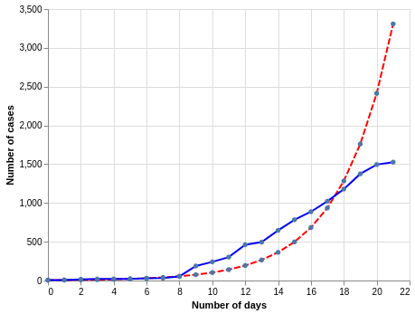

# Exponential Library

A library used for analyzing data which has an underlying exponential nature, whether growth or decay. I am developing this library and I still have to document the API but if you look at the code then you should be able to use the library.
It assumes that the input list is a geometric sequence.

## Features
It can create perform a number of operations on any given dataset. It involves the following:
- Create a list of the differences in the list between any two or all consecutive values. Usually referred to as 'r' in maths
- Project the growth for any given dataset, which depends on the value upto which to project the growth or decay
- Create a graph of the projected values and also of the previous ones in the dataset
- The project is designed in a way that you can basically ignore most of the class methods and easily use any one that you need without breaking the library.

## Current Developments
My next milestone with this project is to connect this to a frontend where it will be used to entirely input the list and then display analysis and projections.

## Requirements
The only requirement is that the input dataset should be a list.  

## Output 
The program gives the output data in the form of a neat graph generated by the altair library. This is a sample.

## What I learned

- Automating a mathematical model 
- The importance of generalization and the implementation of generalization using classes
- File processing
- Writing sub routines to assist in the processing of data
- Graphing data to allow for better visualization and analysis